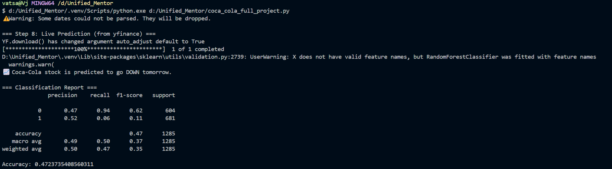
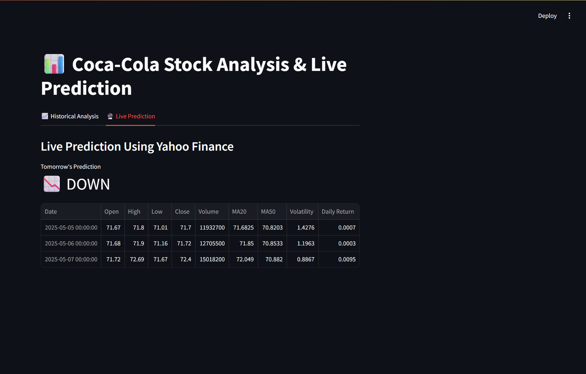

# 🥤 Coca-Cola Stock Analysis & Prediction

This project performs an end-to-end analysis of Coca-Cola's stock performance using historical data, technical indicators, and machine learning. It also supports live prediction using Yahoo Finance and includes a complete presentation and dashboard screenshots.

---

## 📌 Features

- 📥 Load and clean historical stock data
- 🧠 Feature engineering: MA20, MA50, RSI, MACD, Bollinger Bands
- 🔮 Predict next-day **Close price** using Random Forest Regressor
- 🔁 Predict stock **movement (Up/Down)** using Random Forest Classifier
- 📡 Live prediction using `yfinance` latest data
- 📈 Visualizations for trends and indicators
- 🖼️ PowerPoint report and Streamlit dashboard screenshot

---

## 📁 Project Structure

```
coca-cola-stock-analysis/
├── Coca-Cola_stock_history.csv               # Historical price data
├── Coca-Cola_stock_info.xlsx                 # Meta info (optional)
├── coca_cola_enhanced_project.ipynb          # Final Jupyter Notebook (with ML, indicators)
├── CocaCola_Stock_Analysis_Report_Final.pptx # Final presentation
├── dashboard.png                              # Streamlit dashboard screenshot
├── terminal_output.png                        # Terminal live prediction output
├── requirements.txt                           # Final environment setup (no backtesting)
├── README.md                                  # You're reading it
```

---

## 🧪 Setup Instructions

### 1. Install Python packages

```bash
pip install -r requirements.txt
```

*Backtesting is not included due to Python 3.12+ compatibility issues.*

### 2. Run the Notebook

Open `coca_cola_enhanced_project.ipynb` in Jupyter Notebook or JupyterLab.

---

## 📈 Technical Indicators Used

- MA20, MA50 (Moving Averages)
- Volatility (20-day rolling STD)
- RSI (Relative Strength Index)
- MACD and MACD Signal
- Bollinger Bands (High/Low)

---

## 🔮 Machine Learning

### Random Forest Regressor
- Target: Next-day `Close` price
- Metrics: MSE, RMSE, MAE

### Random Forest Classifier
- Target: Predict stock goes **Up (1)** or **Down (0)**
- Metrics: Accuracy, F1, Classification Report

---

## 📷 Screenshots

### Terminal Output (Live Prediction)


### Streamlit Dashboard


---

## 📊 Presentation

PowerPoint summarizing the full project:
- Problem statement
- Data sources
- Technical indicators
- ML model results
- Live prediction
- Screenshots

👉 `CocaCola_Stock_Analysis_Report_Final.pptx`

---

## ✅ Requirements

Tested on Python 3.12 with:
```
pandas
numpy
matplotlib
seaborn
scikit-learn
yfinance
openpyxl
joblib
streamlit
ta
```

---

## ✍️ Author

**Your Name**  
[GitHub](https://github.com/vatsalj2005)  
[LinkedIn](https://linkedin.com/in/vatsalj2005)

---

## ⚠️ Notes

- Backtesting was skipped due to incompatibility with Python 3.12+
- For full compatibility, use Python 3.9+ if you want to add backtesting

---

## 📄 License

This project is open-source under the [MIT License](LICENSE).
